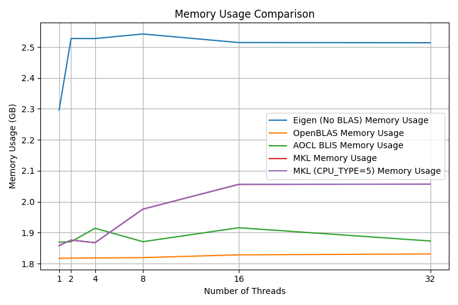

# BLAS benchmarks

The benchmark plots below show the performance of different BLAS libraries (OpenBLAS, Intel MKL, AMD AOCL BLIS) with different numbers of threads on my Ryzen Zen3 5950X (16c/32t). In my case, 16 threads with OpenBLAS is a good blend of performance and memory usage.

I didn't include any GPU BLAS libraries (NVBLAS, cuBLAS, etc.) because the I'm limiting the scope of demucs.cpp to use only the CPU. The real PyTorch version of Demucs is suitable for GPU acceleration.
