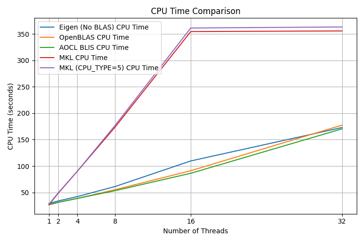

### Multi-core, OpenMP, BLAS, etc.

:warning: `demucs.cpp` library code in `./src` **should not use any threading (e.g. pthread or OpenMP) except through the BLAS interface.** This is because demucs.cpp is compiled to a single-threaded WebAssembly module in <https://freemusicdemixer.com>.

If you have OpenMP and OpenBLAS installed, OpenBLAS might automatically use all of the threads on your machine, which doesn't always run the fastest. Use the `OMP_NUM_THREADS` environment variable to limit this. On my 16c/32t machine, I found `OMP_NUM_THREADS=16` to be the fastest. This matches the [Eigen recommendation](https://eigen.tuxfamily.org/dox/TopicMultiThreading.html) to use the same number of threads as physical cores:
>On most OS it is very important to limit the number of threads to the number of physical cores, otherwise significant slowdowns are expected, especially for operations involving dense matrices.

### BLAS benchmarks

The benchmark plots below show the performance of different BLAS libraries (OpenBLAS, Intel MKL, AMD AOCL BLIS) with different numbers of threads on my Ryzen Zen3 5950X (16c/32t). In my case, 16 threads with OpenBLAS is a good blend of performance and memory usage.





I didn't include any GPU BLAS libraries (NVBLAS, cuBLAS, etc.) because the I'm limiting the scope of demucs.cpp to use only the CPU. The real PyTorch version of Demucs is suitable for GPU acceleration.

### GPUs, cuBLAS, NVBLAS

There is a [branch](https://github.com/sevagh/demucs.cpp/tree/nvblas) where I explored NVBLAS (a cuBLAS wrapper with automatic host-GPU memory transfers). It's not very useful, but it's what I expect. Demucs.cpp is heavy on the for-loops and small matrix-vector or matrix-matrix multiplications. This is to run on Android phones (typically with small amounts of memory, 6-8 GB on flagships) and in WebAssembly (which has a 4 GB memory limit per module).

If I wrote it to use large matrix broadcasts, it would probably be faster (while consuming more memory and breaking the intended usecase), and accelerate much better on GPUs.

### Multi-threading

There are two new programs, `demucs_mt.cpp.main` and `demucs_ft_mt.cpp.main` that use C++11 [std::threads](https://en.cppreference.com/w/cpp/thread/thread).

In the single-threaded programs:

* User supplies a waveform of length N seconds
* Waveform is split into 7.8-second segments for Demucs inference
* Segments are processed sequentially, where each segment inference can use >1 core with `OMP_NUM_THREADS`

In the multi-threaded programs:
* User supplies a waveform of length N seconds and a `num_threads` argument
* Waveform is split into `num_threads` sub-waveforms (of length M < N) to process in parallel with a 0.75-second overlap
    * We always need overlapping segments in audio applications to eliminate [boundary artifacts](https://freemusicdemixer.com/under-the-hood/2024/02/23/Demucs-segmentation#boundary-artifacts-and-the-overlap-add-method)
* `num_threads` threads are launched to perform Demucs inference on the sub-waveforms in parallel
* Within each thread, the sub-waveform is split into 7.8-second segments
* Segments within a thread are still processed sequentially, where each segment inference can use >1 core with `OMP_NUM_THREADS`

For the single-threaded `demucs.cpp.main`, my suggestion is `OMP_NUM_THREADS=$num_physical_cores`. On my 5950X system with 16 cores, execution time for a 4-minute song:
```
real    10m23.201s
user    29m42.190s
sys     4m17.248s
```

For the multi-threaded `demucs_mt.cpp.main`, using 4 `std::thread` and OMP threads = 4 (4x4 = 16 physical cores):
```
real    4m9.331s
user    18m59.731s
sys     3m28.465s
```

More than 2x faster for 4 threads. This is inspired by the parallelism strategy used in <https://freemusicdemixer.com>.

V3 is a faster algorithm and the mt variant (with 4 threads) runs in 2.5 min:
```
real    2m35.737s
user    10m28.019s
sys     2m42.292s
```
