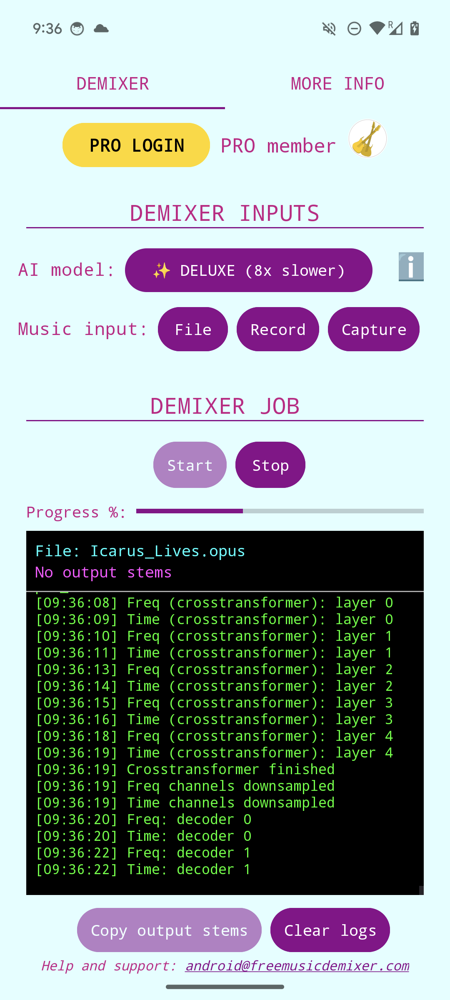

# demucs.cpp

C++17 library that implements inference for the [Demucs v4 hybrid transformer](https://github.com/facebookresearch/demucs) and [Demucs v3 hybrid](https://github.com/facebookresearch/demucs/tree/v3) models, which are high-performance PyTorch neural networks for music source separation.

It uses only the standard library (C++17) and the header-only library [Eigen](https://eigen.tuxfamily.org/index.php?title=Main_Page) as dependencies, making it suitable to compile and run on many platforms. It was designed for low-memory environments by sacrificing the speed of the Torch implementation.

Demucs.cpp powers my websites (<https://freemusicdemixer.com>, <https://pro.freemusicdemixer.com>) and now my new Android app [Music Demixer](https://play.google.com/store/apps/details?id=com.freemusicdemixer.pro) to bring Demucs to your pocket!

<a href="https://play.google.com/store/apps/details?id=com.freemusicdemixer.pro"></a> <a href="https://play.google.com/store/apps/details?id=com.freemusicdemixer.pro"></a>

See my other project [umx.cpp](https://github.com/sevagh/umx.cpp) for a similar library for Open-Unmix.

### Library design

The inference library (in `src/`) uses the [ggml](https://github.com/ggerganov/ggml) file format to serialize the PyTorch weights of `hdemucs_mmi`, `htdemucs`, `htdemucs_6s`, and `htdemucs_ft` (v3, v4 4-source, v4 6-source, v4 fine-tuned) to a binary file format, and [Eigen](https://eigen.tuxfamily.org/index.php?title=Main_Page) to implement the inference (with OpenMP as a requirement).

The cli programs (in `cli-apps/`) additionally use [libnyquist](https://github.com/ddiakopoulos/libnyquist) to read and write audio files, and the multithreaded cli programs use C++11's `std::thread`.

**All Hybrid-Transformer weights** (4-source, 6-source, fine-tuned) are supported. See the [Convert weights](#convert-weights) section below. Inference for the **Demucs v3 Hybrid model weights** `hdemucs_mmi` is also supported. Demixing quality is practically identical to PyTorch as shown in the [SDR scores doc](./.github/SDR_scores.md).

### Directory structure

`src` contains the library for Demucs inference, and `cli-apps` contains four driver programs, which compile to:
1. `demucs.cpp.main`: run a single model (4s, 6s, or a single fine-tuned model)
1. `demucs_ft.cpp.main`: run all four fine-tuned models for `htdemucs_ft` inference, same as the BagOfModels idea of PyTorch Demucs
1. `demucs_mt.cpp.main`: run a single model, multi-threaded
1. `demucs_ft_mt.cpp.main`: run all four fine-tuned models, multi-threaded
1. `demucs_v3.cpp.main`: run a single model for v3 `hdemucs_mmi`
1. `demucs_v3_mt.cpp.main`: run a single model for v3 `hdemucs_mmi`, multi-threaded

See the [PERFORMANCE doc](./.github/PERFORMANCE.md) for time measurements, benchmarks, details on multi-threading, external BLAS libraries, etc.

## Instructions

### Build C++ code

Clone the repo

Make sure you clone with submodules to get all vendored libraries (e.g. Eigen):
```
$ git clone --recurse-submodules https://github.com/sevagh/demucs.cpp
```

Install C++ dependencies, e.g. CMake, gcc, C++/g++, OpenBLAS for your OS (my instructions are for Pop!\_OS 22.04):
```
$ sudo apt-get install gcc g++ cmake clang-tools libopenblas0-openmp libopenblas-openmp-dev
```

Compile with CMake:
```
$ mkdir -p build && cd build && cmake .. && make -j16
```

### Download weights

Pre-converted and ready to use ggml-weights can be downloaded at [huggingface](https://huggingface.co/datasets/Retrobear/demucs.cpp/tree/main).
These were created as described below.

### Convert weights

Set up a Python env

The first step is to create a Python environment (however you like; I'm a fan of [mamba](https://mamba.readthedocs.io/en/latest/user_guide/mamba.html)) and install the `requirements.txt` file:
```
$ mamba create --name demucscpp python=3.11
$ mamba activate demucscpp
$ python -m pip install -r ./scripts/requirements.txt
```

Dump Demucs weights to ggml file, with flag `--six-source` for the 6-source variant, all of `--ft-drums, --ft-vocals, --ft-bass, --ft-other` for the fine-tuned models, and `--v3` for the v3 model:
```
$ python ./scripts/convert-pth-to-ggml.py ./ggml-demucs
...
Processing variable:  crosstransformer.layers_t.4.norm2.bias  with shape:  (512,)  , dtype:  float16
Processing variable:  crosstransformer.layers_t.4.norm_out.weight  with shape:  (512,)  , dtype:  float16
Processing variable:  crosstransformer.layers_t.4.norm_out.bias  with shape:  (512,)  , dtype:  float16
Processing variable:  crosstransformer.layers_t.4.gamma_1.scale  with shape:  (512,)  , dtype:  float16
Processing variable:  crosstransformer.layers_t.4.gamma_2.scale  with shape:  (512,)  , dtype:  float16
Done. Output file:  ggml-demucs/ggml-model-htdemucs-4s-f16.bin
```

All supported models would look like this:
```
$ ls ./ggml-demucs/
total 613M
160M May  5 14:38 ggml-model-hdemucs_mmi-v3-f16.bin
 53M May  5 16:50 ggml-model-htdemucs-6s-f16.bin
 81M May  5 16:50 ggml-model-htdemucs_ft_vocals-4s-f16.bin
 81M May  5 16:50 ggml-model-htdemucs_ft_bass-4s-f16.bin
 81M May  5 16:50 ggml-model-htdemucs_ft_drums-4s-f16.bin
 81M May  5 16:50 ggml-model-htdemucs_ft_other-4s-f16.bin
 81M May  5 16:51 ggml-model-htdemucs-4s-f16.bin
```

### Run demucs.cpp

Run C++ inference on your track with the built binaries:
```
# build is the cmake build dir from above
$ ./build/demucs.cpp.main ../ggml-demucs/ggml-model-htdemucs-4s-f16.bin /path/to/my/track.wav  ./demucs-out-cpp/
...
Loading tensor crosstransformer.layers_t.4.gamma_2.scale with shape [512, 1, 1, 1]
crosstransformer.layers_t.4.gamma_2.scale: [  512], type = float,   0.00 MB
Loaded model (533 tensors,  80.08 MB) in 0.167395 s
demucs_model_load returned true
Starting demucs inference
...
Freq: decoder 3
Time: decoder 3
Mask + istft
mix: 2, 343980
mix: 2, 343980
mix: 2, 343980
mix: 2, 343980
returned!
Writing wav file "./demucs-out-cpp/target_0_drums.wav"
Encoder Status: 0
Writing wav file "./demucs-out-cpp/target_1_bass.wav"
Encoder Status: 0
Writing wav file "./demucs-out-cpp/target_2_other.wav"
Encoder Status: 0
Writing wav file "./demucs-out-cpp/target_3_vocals.wav"
Encoder Status: 0
```

For the 6-source model, additional targets 4 and 5 correspond to guitar and piano.
