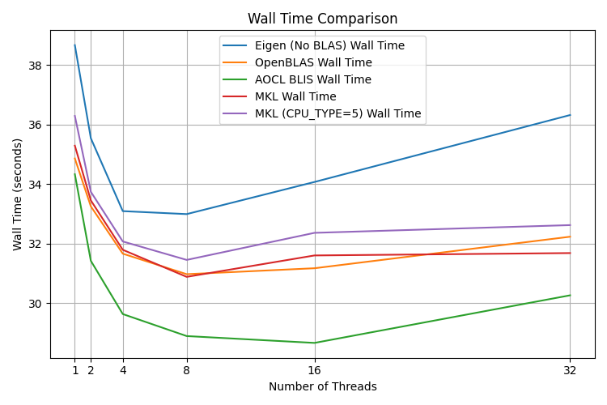
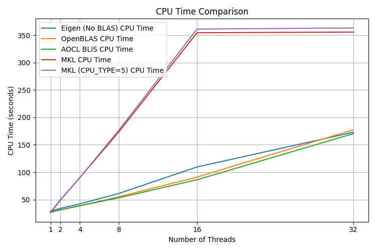
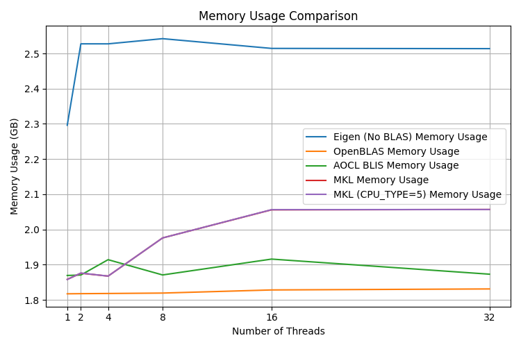

# demucs.cpp

C++17 implementation of the [Demucs v4 hybrid transformer](https://github.com/facebookresearch/demucs), a PyTorch neural network for music demixing. Similar project to [umx.cpp](https://github.com/sevagh/umx.cpp). This code powers my site <https://freemusicdemixer.com>.

It uses [libnyquist](https://github.com/ddiakopoulos/libnyquist) to load audio files, the [ggml](https://github.com/ggerganov/ggml) file format to serialize the PyTorch weights of `htdemucs_4s` and `htdemucs_6s` (4-source, 6-source) to a binary file format, and [Eigen](https://eigen.tuxfamily.org/index.php?title=Main_Page) (+ OpenMP) to implement the inference.

**Both 4- and 6-source variants are supported.** Simply export both models and use the model you want:
```
$ ls -latrh ../ggml-demucs/
total 133M
-rw-rw-r--  1 sevagh sevagh  81M Dec  9 10:42 ggml-model-htdemucs-4s-f16.bin
-rw-rw-r--  1 sevagh sevagh  53M Dec  9 11:37 ggml-model-htdemucs-6s-f16.bin
```

### Multi-core, OpenMP, BLAS, etc.

:warning: `demucs.cpp` library code in `./src` **should not use any threading (e.g. pthread or OpenMP) except through the BLAS interface.** This is because demucs.cpp is intended to for a single-threaded WebAssembly module (in <https://freemusicdemixer.com>).

If you have OpenMP and OpenBLAS installed, OpenBLAS might automatically use all of the threads on your machine, which doesn't always run the fastest. Use the `OMP_NUM_THREADS` environment variable to limit this. On my 16c/32t machine, I found `OMP_NUM_THREADS=16` to be the fastest. This matches the [Eigen recommendation](https://eigen.tuxfamily.org/dox/TopicMultiThreading.html) to use the same number of threads as physical cores:
>On most OS it is very important to limit the number of threads to the number of physical cores, otherwise significant slowdowns are expected, especially for operations involving dense matrices.

See the [BLAS benchmarks](#blas-benchmarks) section below for more details.

### Performance of 4-source model

Track 'Zeno - Signs' from MUSDB18-HQ test set

PyTorch custom inference in [my script](./scripts/demucs_pytorch_inference.py):
```
vocals          ==> SDR:   8.339  SIR:  18.274  ISR:  15.835  SAR:   8.354
drums           ==> SDR:  10.058  SIR:  18.598  ISR:  17.023  SAR:  10.812
bass            ==> SDR:   3.926  SIR:  12.414  ISR:   6.941  SAR:   3.202
other           ==> SDR:   7.421  SIR:  11.289  ISR:  14.241  SAR:   8.179
```
CPP inference (this codebase):
```
vocals          ==> SDR:   8.339  SIR:  18.276  ISR:  15.836  SAR:   8.346
drums           ==> SDR:  10.058  SIR:  18.596  ISR:  17.019  SAR:  10.810
bass            ==> SDR:   3.919  SIR:  12.436  ISR:   6.931  SAR:   3.182
other           ==> SDR:   7.421  SIR:  11.286  ISR:  14.252  SAR:   8.183
```
*n.b.* for the above results, the random shift in the beginning of the song was fixed to 1337 in both PyTorch and C++.

### Performance of 6-source model

Track 'Zeno - Signs' from MUSDB18-HQ test set

PyTorch custom inference in [my script](./scripts/demucs_pytorch_inference.py) with `--six-source` flag:
```
vocals          ==> SDR:   8.396  SIR:  18.695  ISR:  16.076  SAR:   8.580
drums           ==> SDR:   9.928  SIR:  17.930  ISR:  17.523  SAR:  10.635
bass            ==> SDR:   4.522  SIR:  10.447  ISR:   8.618  SAR:   4.374
other           ==> SDR:   0.168  SIR:  11.449  ISR:   0.411  SAR:  -2.720
```
CPP inference (this codebase):
```
vocals          ==> SDR:   8.395  SIR:  18.699  ISR:  16.076  SAR:   8.576
drums           ==> SDR:   9.927  SIR:  17.921  ISR:  17.518  SAR:  10.635
bass            ==> SDR:   4.519  SIR:  10.458  ISR:   8.606  SAR:   4.370
other           ==> SDR:   0.164  SIR:  11.443  ISR:   0.409  SAR:  -2.713
```

*n.b.* the "other" score will be artificially low because of the extra guitar + piano separation where there are no stems to compare to

## Instructions

0. Clone the repo

Make sure you clone with submodules:
```
$ git clone --recurse-submodules https://github.com/sevagh/demucs.cpp
```

Eigen is vendored as a git submodule.

1. Set up Python

The first step is to create a Python environment (however you like; I'm a fan of [mamba](https://mamba.readthedocs.io/en/latest/user_guide/mamba.html)) and install the `requirements.txt` file:
```
$ mamba create --name demucscpp python=3.11
$ mamba activate demucscpp
$ python -m pip install -r ./scripts/requirements.txt
```

2. Dump Demucs weights to ggml file, with flag `--six-source` for the 6-source variant:
```
$ python ./scripts/convert-pth-to-ggml.py ./ggml-demucs
...
Processing variable:  crosstransformer.layers_t.4.norm2.bias  with shape:  (512,)  , dtype:  float16
Processing variable:  crosstransformer.layers_t.4.norm_out.weight  with shape:  (512,)  , dtype:  float16
Processing variable:  crosstransformer.layers_t.4.norm_out.bias  with shape:  (512,)  , dtype:  float16
Processing variable:  crosstransformer.layers_t.4.gamma_1.scale  with shape:  (512,)  , dtype:  float16
Processing variable:  crosstransformer.layers_t.4.gamma_2.scale  with shape:  (512,)  , dtype:  float16
Done. Output file:  ggml-demucs/ggml-model-htdemucs-4s-f16.bin
```

3. Install C++ dependencies, e.g. CMake, gcc, C++/g++, OpenMP for your OS - my instructions are for Pop!\_OS 22.04:
```
$ sudo apt-get install gcc g++ cmake clang-tools
```

4. Compile with CMake:
```
$ mkdir -p build && cd build && cmake .. && make
```

5. Run inference on your track:
```
$ ./demucs.cpp.main ../ggml-demucs/ggml-model-htdemucs-4s-f16.bin /path/to/my/track.wav  ./demucs-out-cpp/
...
Loading tensor crosstransformer.layers_t.4.gamma_2.scale with shape [512, 1, 1, 1]
crosstransformer.layers_t.4.gamma_2.scale: [  512], type = float,   0.00 MB
Loaded model (533 tensors,  80.08 MB) in 0.167395 s
demucs_model_load returned true
Starting demucs inference
...
Freq: decoder 3
Time: decoder 3
Mask + istft
mix: 2, 343980
mix: 2, 343980
mix: 2, 343980
mix: 2, 343980
returned!
Writing wav file "./demucs-out-cpp/target_0.wav"
Encoder Status: 0
Writing wav file "./demucs-out-cpp/target_1.wav"
Encoder Status: 0
Writing wav file "./demucs-out-cpp/target_2.wav"
Encoder Status: 0
Writing wav file "./demucs-out-cpp/target_3.wav"
Encoder Status: 0
```

For the 6-source model, additional targets 4 and 5 correspond to guitar and piano.

Note: I have only tested this on my Linux-based computer (Pop!\_OS 22.04), and you may need to figure out how to get the dependencies on your own.

## Dev tips

* make lint
* Valgrind memory error test: `valgrind --leak-check=full --show-leak-kinds=all --track-origins=yes --verbose ./demucs.cpp.main ../ggml-demucs/ggml-model-htdemucs-f16.bin ../test/data/gspi_stereo.wav  ./demucs-out-cpp/`
* Callgrind + KCachegrind: `valgrind --tool=callgrind ./demucs.cpp.test --gtest_filter='*FreqDec*'`

## BLAS benchmarks

The benchmark plots below show the performance of different BLAS libraries (OpenBLAS, Intel MKL, AMD AOCL BLIS) with different numbers of threads on my Ryzen Zen3 5950X (16c/32t). In my case, 16 threads with OpenBLAS is a good blend of performance and memory usage.





I didn't include any GPU BLAS libraries (NVBLAS, cuBLAS, etc.) because the I'm limiting the scope of demucs.cpp to use only the CPU. The real PyTorch version of Demucs is suitable for GPU acceleration.
